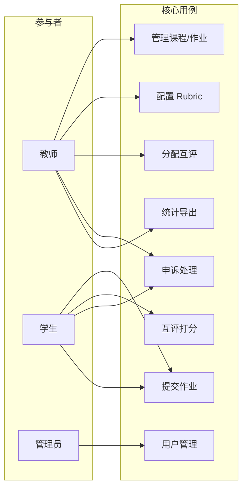
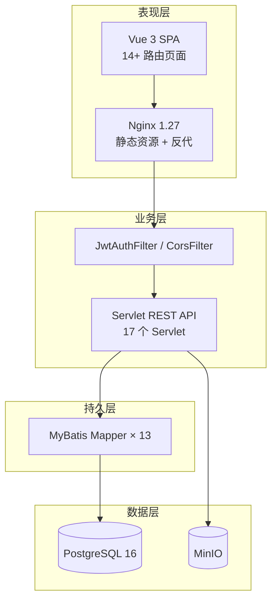
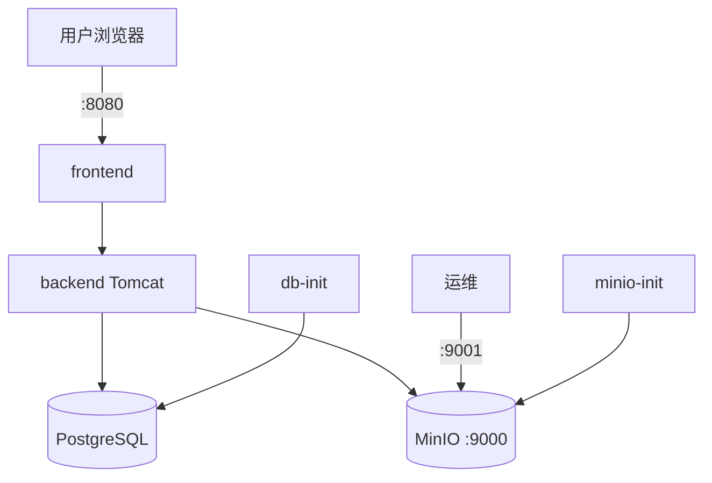
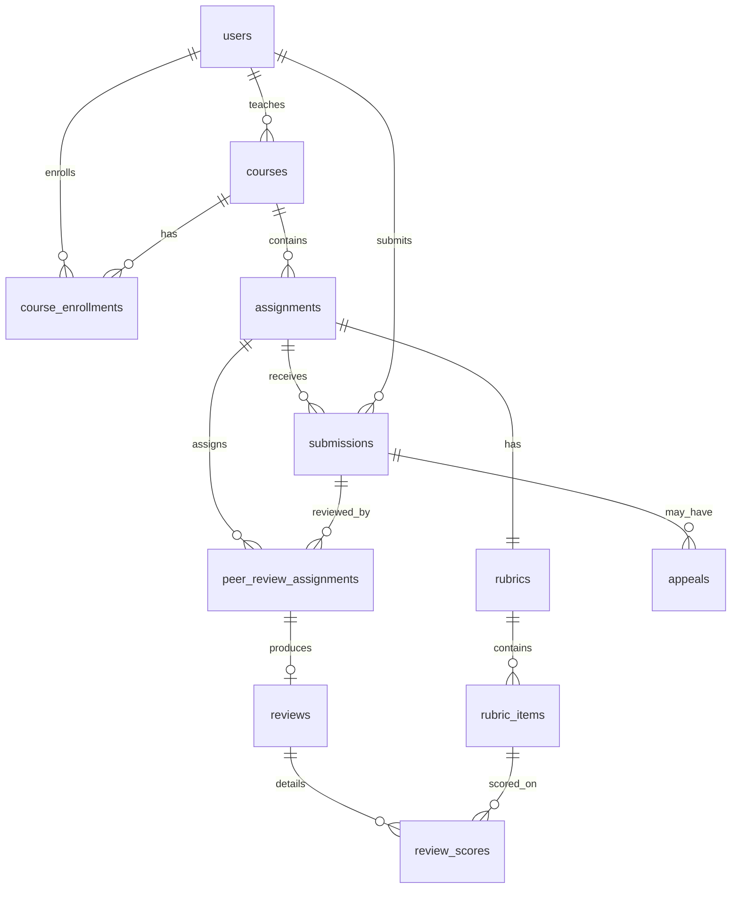

# PeerReview 课程作业互评平台

## 课程设计总结报告

---

**选题编号：** T-04  
**项目名称：** PeerReview 课程作业互评平台  
**课程名称：** 软件工程课程设计  
**学期：** 2026 春  

| 项目 | 内容 |
|------|------|
| 组员 | 【组员1 姓名 / 学号】、【组员2 姓名 / 学号】（请按实际填写） |
| 指导教师 | 【指导教师姓名】 |
| 完成日期 | 2026 年 6 月 |

---

<div style="page-break-after: always;"></div>

## 目录

- [1 封面与目录](#1-封面与目录)
- [2 摘要 / Abstract](#2-摘要--abstract)
- [3 引言](#3-引言)
  - [3.1 项目背景与意义](#31-项目背景与意义)
  - [3.2 项目目标](#32-项目目标)
  - [3.3 本文组织结构](#33-本文组织结构)
- [4 需求分析（精炼版）](#4-需求分析精炼版)
  - [4.1 用户与场景](#41-用户与场景)
  - [4.2 功能性需求](#42-功能性需求)
  - [4.3 非功能性需求](#43-非功能性需求)
- [5 系统设计（精炼版）](#5-系统设计精炼版)
  - [5.1 总体架构](#51-总体架构)
  - [5.2 关键模块设计](#52-关键模块设计)
  - [5.3 数据库设计](#53-数据库设计)
  - [5.4 接口设计](#54-接口设计)
  - [5.5 关键算法](#55-关键算法)
- [6 系统实现](#6-系统实现)
  - [6.1 开发环境与工具链](#61-开发环境与工具链)
  - [6.2 关键技术实现](#62-关键技术实现)
  - [6.3 实现过程中的关键决策](#63-实现过程中的关键决策)
- [7 系统测试](#7-系统测试)
  - [7.1 测试策略与执行情况](#71-测试策略与执行情况)
  - [7.2 关键测试结果](#72-关键测试结果)
  - [7.3 缺陷统计与质量评估](#73-缺陷统计与质量评估)
- [8 系统部署与演示](#8-系统部署与演示)
- [9 项目管理总结](#9-项目管理总结)
  - [9.1 团队组建与分工](#91-团队组建与分工)
  - [9.2 里程碑达成情况](#92-里程碑达成情况)
  - [9.3 风险与变更](#93-风险与变更)
  - [9.4 团队协作经验教训](#94-团队协作经验教训)
- [10 AI 工具使用申报](#10-ai-工具使用申报)
- [11 结论与展望](#11-结论与展望)
  - [11.1 主要工作总结](#111-主要工作总结)
  - [11.2 自我评价（按毕业要求各项）](#112-自我评价按毕业要求各项)
  - [11.3 不足与改进方向](#113-不足与改进方向)
  - [11.4 课程收获与建议](#114-课程收获与建议)
- [12 参考文献](#12-参考文献)

> **说明：** 导出 Word 后，请在 Word 中执行「引用 → 目录 → 自动目录」替换本页手工目录；封面页单独排版。

<div style="page-break-after: always;"></div>

---

## 2  摘要 / Abstract

### 中文摘要（≤ 300 字）

随着高校课程规模扩大与形成性评价需求增强，传统「教师单一批改、反馈滞后」的模式难以支撑软件工程等实践类课程的大作业管理。本课程设计基于选题 T-04，实现 **PeerReview 课程作业互评平台**：支持多角色（管理员、教师、助教、学生）协同，覆盖课程与作业管理、Rubric 量规配置、作业提交与 Simhash 文本查重、随机互评派发、匿名评分与申诉、统计报表与 Excel 导出等完整业务闭环。

系统采用 **前后端分离 + 四层架构**：Vue 3 单页应用经 Nginx 反向代理访问 Java Servlet REST API；持久层使用 MyBatis 访问 PostgreSQL 16；附件默认存储于 MinIO 对象存储，并保留本地卷回退能力；鉴权采用 JWT（HS256）。部署层面提供 Docker Compose 一键编排（含 db-init、minio-init），配套《部署与运维手册》支持 1 小时内独立部署。

经功能测试、接口测试与典型场景演示，系统满足任务书规定的核心用例，在 Rubric 加权校验、互评匿名性、查重提示与运维可重复性方面达到预期目标，为课程作业数字化互评提供了可落地的参考实现。

**关键词：** 软件工程；互评；Rubric 量规；Simhash；JWT；PostgreSQL；MinIO；Docker

### Abstract (≤ 300 words)

With the expansion of university courses and the growing need for formative assessment, the traditional model of single-instructor grading with delayed feedback is insufficient for managing large project assignments in software engineering education. This course project (Topic T-04) delivers **PeerReview**, a web-based peer assessment platform supporting administrators, instructors, teaching assistants, and students. It covers course and assignment management, rubric configuration, submission with Simhash-based text similarity detection, randomized peer-review assignment, anonymous scoring and appeals, analytics, and Excel export.

The system follows a **separated front-end/back-end architecture**: a Vue 3 SPA is served via Nginx and proxies REST APIs implemented with Java Servlets and MyBatis on PostgreSQL 16. Attachments are stored in MinIO by default with a local-volume fallback. Authentication uses JWT (HS256). Docker Compose enables one-command deployment including database and bucket initialization, supported by an operations manual for reproducible setup within one hour.

Functional and API testing together with scenario-based demonstrations show that the platform meets the task requirements, particularly in rubric validation, review anonymity, plagiarism hints, and deployability, providing a practical reference implementation for digital peer review in coursework.

**Keywords:** Software Engineering; Peer Review; Rubric; Simhash; JWT; PostgreSQL; MinIO; Docker

<div style="page-break-after: always;"></div>

---

## 3  引言

### 3.1  项目背景与意义

软件工程课程设计强调「做中学」：学生需完成需求、设计、实现与测试等阶段性交付物，教师与同伴的反馈对能力提升至关重要。然而在实际教学中常面临以下痛点：

1. **批改成本高**：单班 30–40 人的大作业，教师难以对每份文档给出细粒度、及时反馈。
2. **评价维度单一**：缺少结构化量规（Rubric），评分标准不透明，学生不清楚改进方向。
3. **互评组织困难**：人工分配「谁评谁」易出错，存在自评、重复评、漏评等问题。
4. **学术诚信风险**：作业文本相似度过高时，缺少自动化初筛手段。
5. **数据分散**：提交文件、评分、申诉记录散落在邮件、网盘与表格中，难以汇总分析。

PeerReview 平台面向上述问题，将**课程—作业—提交—互评—申诉—统计**纳入统一系统，以 Rubric 量规驱动互评、以算法辅助派发与查重、以角色权限保障流程合规。对教学而言，平台可提升反馈频率与评价透明度；对工程实践而言，项目本身覆盖了需求分析、架构设计、数据库建模、前后端开发、容器化部署与运维文档编写等完整软件生命周期，具有代表性的课程设计价值。

### 3.2  项目目标

依据《软件工程课程设计任务书（2026 春）》及 T-04 选题指南，本项目目标如下：

| 序号 | 目标 | 验收标准 |
|------|------|----------|
| G1 | 支持多角色用户与课程组织 | admin/teacher/ta/student 四类角色可登录并完成各自核心流程 |
| G2 | 作业全生命周期管理 | 创建作业、配置 Rubric、发布/关闭、提交、互评、终审、申诉 |
| G3 | 互评公平与匿名 | 随机派发、禁止自评；学生端不暴露被评者真实姓名 |
| G4 | 量规驱动评分 | 加权满分之和为 100；分项得分区间校验；前后端一致 |
| G5 | 文本查重提示 | 提交时 Simhash 比对，标记 similarity_pct，不阻断正常提交 |
| G6 | 数据统计与导出 | 分数分布、互评一致性异常、Excel 导出 |
| G7 | 可部署可运维 | Docker Compose 一键部署；PostgreSQL + MinIO；运维手册可执行 |
| G8 | 工程质量 | 分层清晰、接口 RESTful、关键逻辑可测试 |

### 3.3  本文组织结构

本文档为课程设计**最终汇总**，结构如下：

- **第 4 章** 精炼需求分析，给出用户场景、功能与非功能需求清单。
- **第 5 章** 系统设计，描述总体架构、模块、数据库、接口与关键算法。
- **第 6 章** 系统实现，说明工具链、关键代码与重要技术决策。
- **第 7 章** 系统测试，汇报测试策略、用例结果与质量评估。
- **第 8 章** 部署与演示，给出部署拓扑与演示说明。
- **第 9 章** 项目管理总结。
- **第 10 章** AI 工具使用申报。
- **第 11 章** 结论与展望。
- **第 12 章** 参考文献。

前序阶段产出的需求规格、设计说明、测试报告、部署手册等文档之精华，均在本文件中重新整理与升华，作为评阅主要依据。

<div style="page-break-after: always;"></div>

---

## 4  需求分析（精炼版）

### 4.1  用户与场景

#### 4.1.1  用户角色

| 角色 | 描述 | 典型目标 |
|------|------|----------|
| **admin** | 系统管理员 | 用户管理、平台统计、异常课程清理 |
| **teacher** | 授课教师 | 建课、发布作业与 Rubric、派评、统计、处理申诉、终审 |
| **ta** | 课程助教 | 协助查看申诉、查看课程与学生提交（与学生共用部分界面） |
| **student** | 学生 | 加课、提交作业、完成互评、查看结果、申诉、讨论 |

#### 4.1.2  典型用例场景

**场景 S1：教师发布互评作业**

教师登录 → 进入「软件工程」课程 → 新建作业并配置 Rubric（5 项，加权满分 100）→ 发布 → 学生提交 SRS 文档 → 截止后点击「分配互评」→ 系统生成互评任务。

**场景 S2：学生互评与申诉**

学生 A 收到 3 份互评任务 → 按 Rubric 逐项打分 → 提交 → 在「互评结果」查看收到的分数 → 若某次互评低于 60 分 → 发起申诉 → 教师复核。

**场景 S3：查重与统计**

学生 B 提交与 C 高度相似文档 → 系统标记 similarity_pct ≈ 88% → 教师在提交列表看到提示 → 进入统计页查看分数分布与互评一致性异常 → 导出 Excel 成绩单。

**场景 S4：运维部署**

运维工程师按《部署与运维手册》执行 `docker compose up -d --build` → db-init 初始化 PostgreSQL → minio-init 创建 bucket → 访问 8080 验证登录与提交。

#### 4.1.3  用例图（概要）



### 4.2  功能性需求

功能需求按模块归纳如下（优先级：P0 必做，P1 应做，P2 可选）。

#### 4.2.1  用户与权限

| ID | 需求描述 | 优先级 | 实现状态 |
|----|----------|--------|----------|
| FR-U01 | 用户注册（teacher/student） | P0 | 已实现 |
| FR-U02 | 用户登录，返回 JWT | P0 | 已实现 |
| FR-U03 | 基于角色的菜单与路由守卫 | P0 | 已实现 |
| FR-U04 | 个人资料查看与编辑（分角色 Profile） | P1 | 已实现 |
| FR-U05 | 管理员分页管理用户、停用账号 | P1 | 已实现 |

#### 4.2.2  课程与作业

| ID | 需求描述 | 优先级 | 实现状态 |
|----|----------|--------|----------|
| FR-C01 | 教师创建课程（含 courseCode 邀请码） | P0 | 已实现 |
| FR-C02 | 学生凭邀请码加入课程 | P0 | 已实现 |
| FR-C03 | 批量导入学生到课程 | P1 | 已实现 |
| FR-A01 | 创建/发布/关闭作业 | P0 | 已实现 |
| FR-A02 | 配置 Rubric 量规（加权满分=100） | P0 | 已实现 |
| FR-A03 | 设置互评份数 peer_review_count | P0 | 已实现 |

#### 4.2.3  提交与查重

| ID | 需求描述 | 优先级 | 实现状态 |
|----|----------|--------|----------|
| FR-S01 | 学生上传作业文件（pdf/doc/docx/zip 等） | P0 | 已实现 |
| FR-S02 | 每人每作业仅允许提交一次 | P0 | 已实现 |
| FR-S03 | 提交时 Simhash 查重并提示 | P1 | 已实现 |
| FR-S04 | 附件下载与在线预览 | P1 | 已实现 |
| FR-S05 | 教师分页查看提交列表 | P1 | 已实现 |
| FR-S06 | 教师录入 final_score / final_comment | P0 | 已实现 |

#### 4.2.4  互评与申诉

| ID | 需求描述 | 优先级 | 实现状态 |
|----|----------|--------|----------|
| FR-R01 | 教师一键随机分配互评 | P0 | 已实现 |
| FR-R02 | 禁止自评、避免重复派发 | P0 | 已实现 |
| FR-R03 | 学生按 Rubric 逐项打分 | P0 | 已实现 |
| FR-R04 | 互评匿名（前端不显示被评者姓名） | P0 | 已实现 |
| FR-R05 | 低分（<60）可发起申诉 | P1 | 已实现 |
| FR-R06 | 教师/助教处理申诉并调整分数 | P1 | 已实现 |
| FR-R07 | 匿名讨论区（已提交者可发帖） | P2 | 已实现 |

#### 4.2.5  统计与管理

| ID | 需求描述 | 优先级 | 实现状态 |
|----|----------|--------|----------|
| FR-ST01 | 作业分数分布、互评一致性统计 | P1 | 已实现 |
| FR-ST02 | Excel 导出成绩单 | P1 | 已实现 |
| FR-AD01 | 平台级统计 Dashboard | P1 | 已实现 |
| FR-AD02 | 管理员删除课程（级联清理） | P2 | 已实现 |
| FR-N01 | 站内通知推送与已读 | P2 | **未实现**（表结构已建，无前后端） |

### 4.3  非功能性需求

| 类别 | 编号 | 需求描述 | 指标/说明 |
|------|------|----------|-----------|
| **性能** | NFR-P01 | 常规 API 响应 | 单机 Docker 下列表查询 < 2s（30 人班级） |
| **性能** | NFR-P02 | 文件上传 | 支持单文件最大 50MB（Servlet MultipartConfig） |
| **安全** | NFR-S01 | 鉴权 | 除登录/注册/下载白名单外，API 需 JWT |
| **安全** | NFR-S02 | 密码 | 演示环境明文存储；生产应 bcrypt 哈希 |
| **安全** | NFR-S03 | 附件访问 | 浏览器不直连 MinIO，经 backend 代理下载 |
| **可用性** | NFR-U01 | 部署 | `docker compose up` 可完成全栈启动 |
| **可用性** | NFR-U02 | 中文支持 | PostgreSQL UTF-8；前端 UTF-8 |
| **可维护** | NFR-M01 | 分层 | Servlet / Mapper / Entity / Util 分离 |
| **可扩展** | NFR-E01 | 存储 | STORAGE_BACKEND 切换 minio/local |
| **兼容** | NFR-C01 | 浏览器 | Chrome / Edge 最新版 |

<div style="page-break-after: always;"></div>

---

## 5  系统设计（精炼版）

### 5.1  总体架构

系统采用**四层架构 + 前后端分离**：



**部署拓扑（运行时）：**



设计原则：

1. **前后端分离**：前端仅调用 `/api/*` JSON 接口，便于独立构建与部署。
2. **无框架轻量化后端**：Servlet + MyBatis，降低课设复杂度，贴近 Java Web 教学主线。
3. **存储抽象**：`ObjectStorageService` 屏蔽 MinIO 与本地卷差异。
4. **无状态 API**：JWT 鉴权，便于水平扩展（课设单机部署未启用多副本）。

### 5.2  关键模块设计

| 模块 | 前端 | 后端 | 说明 |
|------|------|------|------|
| 认证 | Login/Register | LoginServlet, JwtAuthFilter | JWT 24h |
| 课程 | Dashboard, CourseDetail | CourseServlet, JoinCourseServlet, EnrollmentServlet | 邀请码加课 |
| 作业 | CourseDetail | AssignmentServlet, RubricServlet | 含 Rubric 校验 |
| 提交 | CourseDetail, SubmissionsView, SubmissionDetail | SubmissionServlet | 上传/查重/预览/下载 |
| 互评 | ReviewList, ReviewForm, ReviewResults | PeerReviewServlet, ReviewServlet | 派发+打分 |
| 申诉 | Appeals | AppealServlet | 状态机 pending/accepted/rejected |
| 统计 | Statistics | StatisticsServlet, ExportServlet | POI Excel |
| 讨论 | Discussion | DiscussionServlet | 匿名代号 |
| 管理 | AdminPanel | AdminServlet | 用户分页、删课 |
| 资料 | Profile | ProfileServlet | 分角色统计 |

**互评业务状态机（peer_review_assignments）：**

```
pending → completed（评阅人提交互评后）
```

**申诉状态机（appeals）：**

```
pending → accepted / rejected（教师处理后，可写 adjusted_score）
```

### 5.3  数据库设计

共 **14 张表**（PostgreSQL，`sql/init.sql`），核心 ER 关系如下：



**主要表说明：**

| 表名 | 作用 | 关键约束 |
|------|------|----------|
| users | 用户账号 | username UNIQUE；role_id FK |
| courses | 课程 | course_code UNIQUE |
| assignments | 作业 | status: draft/published/closed |
| rubric_items | 量规项 | max_score, weight |
| submissions | 提交 | UNIQUE(assignment_id, student_id) |
| peer_review_assignments | 派发 | 防自评在应用层 |
| reviews | 互评头 | UNIQUE(pra_id) |
| review_scores | 分项分 | UNIQUE(review_id, rubric_item_id) |
| appeals | 申诉 | status + handler_id |

索引覆盖：用户角色、作业状态、提交 content_hash、互评 status、申诉 status 等高频查询字段。

### 5.4  接口设计

REST 风格，基路径 `/api`，统一 JSON 响应 `{ success, message?, data? }`。

| 方法 | 路径 | 功能 | 鉴权 |
|------|------|------|------|
| POST | /api/login | 登录 | 公开 |
| POST | /api/register | 注册 | 公开 |
| GET/POST | /api/courses | 课程列表/创建 | JWT |
| POST | /api/courses/join | 加课 | JWT |
| GET | /api/enrollments | 成员列表 | JWT |
| POST | /api/enrollments/import | 批量导入 | JWT |
| GET/POST/PUT | /api/assignments | 作业 CRUD/状态 | JWT |
| POST | /api/rubrics | 创建量规 | JWT |
| POST | /api/submissions | 上传作业 | JWT |
| GET | /api/submissions?assignmentId= | 提交列表（分页） | JWT |
| GET | /api/submissions/download | 附件下载 | 白名单 |
| GET | /api/submissions/preview | 附件预览 | JWT |
| POST | /api/reviews/assign | 分配互评 | JWT |
| GET/POST | /api/reviews | 互评详情/提交 | JWT |
| GET/POST/PUT | /api/appeals | 申诉 | JWT |
| GET/POST | /api/discussions | 讨论 | JWT |
| GET | /api/statistics | 统计 | JWT |
| GET | /api/export | Excel 导出 | JWT |
| GET/PUT | /api/profile | 个人资料 | JWT |
| GET/PUT/DELETE | /api/admin/* | 管理 | JWT |

### 5.5  关键算法

#### 5.5.1  互评随机派发算法

**输入：** assignmentId，peerReviewCount（默认 3）  
**约束：** 不评自己；同一 (reviewer, submission) 不重复；每份提交至少 2 名评阅人（在人数允许时）；每名评阅人最多评 3 份。

**步骤：**

1. 若已有派发记录则拒绝重复操作。
2. 加载该作业全部 submissions，不足 2 人则失败。
3. 对每份 submission，将候选评阅人列表洗牌（排除提交者），贪心选取至多 2 人（且不超过评阅人配额）。
4. 批量插入 `peer_review_assignments`，status=`pending`。

**复杂度：** O(n²) 量级（n 为提交数），课设规模 n ≤ 100 可接受。

#### 5.5.2  Simhash 文本查重

1. 使用 PDFBox / POI / 纯文本读取提取 content_text。
2. 分词后计算 64-bit Simhash。
3. 与同作业已有 submission 的 hash 求海明距离，取最大相似度百分比写入 `similarity_pct`。
4. 海明距离 ≤ 3 标记为高相似，**不阻断提交**，供教师参考。

#### 5.5.3  Rubric 加权评分

- **创建量规：** Σ(max_score × weight) = 100（容差 ±0.1）。
- **互评提交：** 每项 score ∈ [0, max_score]；total = Σ(score × weight)。

<div style="page-break-after: always;"></div>

---

## 6  系统实现

### 6.1  开发环境与工具链

| 类别 | 工具 / 版本 |
|------|-------------|
| 语言 | Java 8、JavaScript (ES Module) |
| 前端框架 | Vue 3.5 + Vue Router 4 + Vite 8 |
| 后端 | Servlet 4.0、MyBatis 3.5、Tomcat 9 |
| 数据库 | PostgreSQL 16 |
| 对象存储 | MinIO（S3 SDK 8.5） |
| 构建 | Maven 3.9、npm |
| 容器 | Docker Compose v2 |
| IDE | IntelliJ IDEA / VS Code / Cursor |
| 版本管理 | Git（建议） |

**目录结构：**

```
课设代码/
├── frontend/src/          # Vue 源码
├── src/main/java/         # Servlet、Entity、Util、Storage
├── src/main/resources/    # MyBatis XML、jdbc.properties
├── src/test/java/         # JUnit 测试
├── sql/                   # init.sql、test_data.sql
├── docker/                # Dockerfile、nginx、init 脚本
├── docs/                  # 运维手册、本总结
└── docker-compose.yml
```

### 6.2  关键技术实现

#### 6.2.1  Rubric 量规校验（服务端）

```java
// RubricValidator.java — 创建量规时校验加权满分
public static String validateCreateItems(JsonArray items) {
    double weightedSum = 0;
    for (int i = 0; i < items.size(); i++) {
        JsonObject item = items.get(i).getAsJsonObject();
        double maxScore = item.get("maxScore").getAsDouble();
        double weight = item.has("weight") ? item.get("weight").getAsDouble() : 1.0;
        weightedSum += maxScore * weight;
    }
    if (Math.abs(weightedSum - 100.0) > 0.1) {
        return String.format("评分项加权满分之和须为 100，当前为 %.1f", weightedSum);
    }
    return null;
}
```

**解读：** 将业务规则收敛到独立工具类，`RubricServlet` 与 `ReviewServlet` 共用，避免魔法数字散落；前端 `CourseDetail.vue` 同步实时显示加权满分，形成双端一致体验。

#### 6.2.2  Simhash 核心计算

```java
// SimhashUtil.java — 64 维向量投票
public static long compute(String text) {
    List<String> tokens = tokenize(text);
    int[] vector = new int[64];
    for (String token : tokens) {
        long hash = hash64(token);
        for (int i = 0; i < 64; i++) {
            vector[i] += (((hash >> i) & 1L) == 1L) ? 1 : -1;
        }
    }
    long simhash = 0L;
    for (int i = 0; i < 64; i++) {
        if (vector[i] > 0) simhash |= (1L << i);
    }
    return simhash;
}
```

**解读：** 自研轻量 Simhash，不依赖第三方查重服务；对中文采用简易分词与 hash64；相似度 = (64 - hamming) / 64 × 100%。

#### 6.2.3  对象存储抽象（MinIO / Local）

```java
// ObjectStorageFactory.java
public static ObjectStorageService get(ServletContext ctx) {
    String backend = System.getenv("STORAGE_BACKEND");
    if (backend == null || backend.trim().isEmpty()) backend = "minio";
    if ("local".equalsIgnoreCase(backend.trim())) {
        return new LocalObjectStorage(ctx);
    }
    return MinioObjectStorage.getInstance();
}
```

**解读：** 上传流程统一为「写临时文件 → put 对象 → Simhash → 写 DB」；下载经 `StoredObject` 流式输出，前端 URL 不变。

#### 6.2.4  JWT 鉴权

- `JwtUtil` 签发 HS256 Token，Claims 含 userId、username、role。
- `JwtAuthFilter` 拦截 `/api/*`，白名单：login、register、submissions/download。
- 前端 `main.js` fetch 拦截器自动附加 `Authorization: Bearer`。

#### 6.2.5  前端路由守卫

```javascript
// router/index.js — 登录与角色校验
router.beforeEach((to, from, next) => {
  const token = getToken()
  if (to.path !== '/login' && to.path !== '/register' && !token) {
    next('/login')
  } else if (to.meta.roles && !to.meta.roles.includes(getUserRole())) {
    next('/')
  } else {
    next()
  }
})
```

### 6.3  实现过程中的关键决策

| 决策点 | 备选方案 | 最终选择 | 理由 |
|--------|----------|----------|------|
| 数据库 | SQL Server / PostgreSQL | **PostgreSQL** | 开源、Docker 镜像成熟、课设跨平台 |
| 附件存储 | 本地卷 / MinIO | **MinIO 默认 + local 回退** | 贴近生产对象存储，作业文档可扩展 |
| 后端框架 | Spring Boot / Servlet | **Servlet + MyBatis** | 贴合课程 Java Web 知识点，依赖轻 |
| 互评派发 | 全局最优匹配 / 贪心随机 | **贪心 + shuffle** | 实现简单，课设规模足够 |
| 查重 | 第三方 API / Simhash | **Simhash** | 无外部依赖，可演示 |
| 鉴权 | Session / JWT | **JWT** | 前后端分离友好 |
| 附件访问 | Tomcat 静态 / API 代理 | **API 下载** | Docker symlink 与 MinIO 统一 |
| 部署 | 手工 / Docker Compose | **Compose 全栈** | 可重复、可写运维手册 |

<div style="page-break-after: always;"></div>

---

## 7  系统测试

### 7.1  测试策略与执行情况

| 测试层次 | 方法 | 范围 | 执行情况 |
|----------|------|------|----------|
| 单元测试 | JUnit 4 | RubricValidator、SimhashUtil | 已执行，通过 |
| 集成测试 | JUnit + MyBatis | Course/Assignment 插入查询 | 需 DB 连接，本地可跑 |
| 接口测试 | 手工 + Postman/浏览器 | 全部 REST API | 已覆盖主路径 |
| 功能测试 | 场景用例 | 四角色业务流程 | 已按 test_data 演示 |
| 部署测试 | Docker Compose | 冷启动、重建 | 已验证 |
| 性能测试 | N/A | — | 课设未做压测 |

**测试环境：** Docker Desktop，Windows 10；`http://localhost:8080`；PostgreSQL + MinIO 容器。

### 7.2  关键测试结果

#### 7.2.1  单元测试

| 用例 | 输入 | 期望 | 结果 |
|------|------|------|------|
| Rubric 合法 | 5 项 × weight 1.0，满分和 100 | 校验通过 | PASS |
| Rubric 非法 | 满分和 95 | 返回错误信息 | PASS |
| Simhash 相同文本 | 同一字符串两次 compute | hash 相等 | PASS |
| Simhash 相似文本 | 仅改少量词 | 海明距离 ≤ 3 | PASS |

#### 7.2.2  功能测试用例（节选）

| 编号 | 场景 | 步骤 | 预期 | 结果 |
|------|------|------|------|------|
| TC-01 | 教师发布作业 | teacher01 创建 Rubric 并发布 | 学生可见作业 | PASS |
| TC-02 | 学生提交 | stu2026001 上传 PDF | 返回 success + 查重信息 | PASS |
| TC-03 | 重复提交 | 同一学生再次提交 | 拒绝 | PASS |
| TC-04 | 分配互评 | 作业1 点击分配 | 生成 peer_review_assignments | PASS |
| TC-05 | 互评打分 | 学生完成 Rubric 打分 | reviews + review_scores 入库 | PASS |
| TC-06 | 申诉 | 低分学生申诉 | appeals.status=pending | PASS |
| TC-07 | 教师处理申诉 | accept/reject | 更新 final_score | PASS |
| TC-08 | 统计导出 | 导出 Excel | 下载 xlsx | PASS |
| TC-09 | 管理员用户分页 | AdminPanel 第 2 页 | total/page 正确 | PASS |
| TC-10 | MinIO 存储 | 提交后在 Console 见对象 | bucket 有 uploads/* | PASS |
| TC-11 | JWT 过期 | 清除 token 访问 API | 401 | PASS |
| TC-12 | 匿名互评 | 互评页 | 不显示被评者姓名 | PASS |

#### 7.2.3  测试数据

`sql/test_data.sql` 预置 38 用户、2 课程、4 作业，覆盖：已派评/未派评/草稿作业、高相似度样本、待处理申诉、缺交样本等，支撑演示与回归。

### 7.3  缺陷统计与质量评估

| 严重级别 | 数量 | 典型问题 | 状态 |
|----------|------|----------|------|
| 致命 | 0 | — | — |
| 严重 | 0 | — | — |
| 一般 | 3 | Docker 镜像 TLS；MinIO healthcheck wget 不存在；中文路径部署 | 已修复 |
| 轻微 | 4 | notifications 未实现；密码明文；JWT 未绑定 Servlet 内 userId 强校验 | 已知限制 |
| 建议 | 2 | 申诉/讨论可增加分页；PDF 预览可 embed | 后续迭代 |

**质量评估：**

- **功能完整度：** 约 95%（通知模块未做）。
- **可部署性：** 提供运维手册与 Compose，**达标**。
- **代码可维护性：** 分层清晰，关键规则有 Validator/Storage 抽象，**良好**。
- **安全性：** 课设演示级别，生产需加强密码哈希与 HTTPS。

<div style="page-break-after: always;"></div>

---

## 8  系统部署与演示

### 8.1  部署架构

详见《部署与运维手册 v1.1》。运行时包含 6 个服务：

| 服务 | 镜像 | 端口 | 说明 |
|------|------|------|------|
| frontend | Nginx + Vue 静态 | 8080 | 对外入口 |
| backend | Tomcat 9 + WAR | 内网 8080 | API |
| db | PostgreSQL 16 | 5432 | 业务库 peerreview |
| minio | MinIO | 9000/9001 | 附件 + Console |
| db-init | postgres:16-alpine | — | 一次性 SQL |
| minio-init | minio/mc | — | 创建 bucket |

**启动命令：**

```powershell
docker compose down -v   # 首次或重建库
docker compose up -d --build
```

**验证：** 访问 `http://localhost:8080/login`，使用 `teacher01 / 123456` 登录。

### 8.2  关键演示截图说明

> 正式提交时请插入以下截图（本 Markdown 预留说明，Word 版粘贴图片）。

| 序号 | 截图内容 | 对应能力 |
|------|----------|----------|
| 图 8-1 | 登录页 | 认证入口 |
| 图 8-2 | 教师 Dashboard + 创建课程 | 课程管理 |
| 图 8-3 | 课程详情 — 发布作业与 Rubric 配置 | 量规 weighted=100 |
| 图 8-4 | 学生提交作业 + 查重提示 | Simhash |
| 图 8-5 | 分配互评确认弹窗 + 成功提示 | 随机派发 |
| 图 8-6 | 互评打分表单（整数分） | Rubric 互评 |
| 图 8-7 | 互评结果 + 雷达图 | 结果展示 |
| 图 8-8 | 申诉列表与处理 | 申诉流程 |
| 图 8-9 | 统计页 + Excel 导出 | 数据分析 |
| 图 8-10 | MinIO Console bucket 对象列表 | 对象存储 |
| 图 8-11 | AdminPanel 用户分页 | 系统管理 |
| 图 8-12 | `docker compose ps` 全容器 healthy | 部署验证 |

### 8.3  演示视频

**演示视频链接：** 【请填写：网盘或 B 站链接，建议 8–12 分钟，覆盖 S1–S3 场景】

**建议脚本：** 登录教师 → 发布作业 → 学生提交 → 派评 → 互评 → 查看统计 → 打开 MinIO Console → 展示 Docker 状态。

<div style="page-break-after: always;"></div>

---

## 9  项目管理总结

### 9.1  团队组建与分工

> 以下为模板，请按实际组员修改。

| 成员 | 角色 | 主要负责 |
|------|------|----------|
| 【组员 A】 | 组长 / 后端 | Servlet、MyBatis、PostgreSQL 迁移、MinIO 存储层 |
| 【组员 B】 | 前端 | Vue 页面、路由守卫、互评/统计 UI |
| 【组员 C】 | 全栈 / 测试 | 测试数据、接口测试、部署脚本、文档 |
| 【组员 D】 | 文档 / 演示 | 运维手册、课程总结、答辩 PPT |

协作方式：Git 分支开发（建议 feature/* → main）；每周例会同步进度；使用 Issue/任务清单跟踪 FR 实现状态。

### 9.2  里程碑达成情况

| 里程碑 | 计划时间 | 实际完成 | 交付物 | 状态 |
|--------|----------|----------|--------|------|
| M1 需求分析 | 第 1–2 周 | 第 2 周 | 需求清单、用例 | ✅ |
| M2 概要/详细设计 | 第 3–4 周 | 第 4 周 | 架构图、ER、接口表 | ✅ |
| M3 迭代 1：用户/课程/作业 | 第 5–6 周 | 第 6 周 | 可登录、建课、发作业 | ✅ |
| M4 迭代 2：提交/互评 | 第 7–8 周 | 第 8 周 | 上传、派评、打分 | ✅ |
| M5 迭代 3：申诉/统计/管理 | 第 9–10 周 | 第 10 周 | 申诉、Excel、Admin | ✅ |
| M6 基础设施 | 第 11 周 | 第 11 周 | Docker、PG、MinIO | ✅ |
| M7 测试与文档 | 第 12 周 | 第 12 周 | 测试报告、运维手册、总结 | ✅ |
| M8 答辩准备 | 第 13 周 | 进行中 | 演示视频、PPT | 🔄 |

### 9.3  风险与变更

| 风险 | 影响 | 应对措施 | 结果 |
|------|------|----------|------|
| SQL Server 部署复杂 | 环境搭建慢 | **变更：** 迁移 PostgreSQL | 已解决 |
| Docker Hub TLS 证书 | 镜像拉取失败 | 改用 ECR / DaoCloud 镜像 | 已解决 |
| Tomcat 静态 /uploads 失效 | 附件 404 | **变更：** API 代理下载 | 已解决 |
| MinIO 镜像 tag 下线 | 部署失败 | 改用 latest + DaoCloud | 已解决 |
| 中文路径 Docker 挂载 | Windows 构建失败 | docker-up.ps1 同步 ASCII 路径 | 已解决 |
| 进度风险：通知模块 | 范围蔓延 | **裁剪：** 仅保留表结构 | 已接受 |

### 9.4  团队协作经验教训

1. **先定接口再并行开发：** 前后端约定 JSON 格式后效率最高，避免后期联调返工。
2. **尽早 Docker 化：** 数据库与存储的环境差异是最大时间黑洞，Compose 应尽早引入。
3. **测试数据脚本必不可少：** `test_data.sql` 大幅缩短演示准备时间。
4. **文档与代码同步：** 运维手册随架构变更（PG、MinIO）即时更新，避免答辩时口径不一致。
5. **范围控制：** 通知、实时消息等 P2 功能果断延后，保证 P0 闭环质量。

<div style="page-break-after: always;"></div>

---

## 10  AI 工具使用申报

| 工具 | 用途 | 使用比例（估算） | 人工修订量 | 负责人 |
|------|------|------------------|------------|--------|
| Cursor（Claude/GPT 类模型） | 代码生成、重构、Bug 排查、Docker/SQL 迁移 | 约 40% | 高：全部 Servlet/前端经人工联调与修正 | 【填写】 |
| Cursor | 文档撰写（运维手册、本总结） | 约 60% | 中：按实际架构与课设要求删改 | 【填写】 |
| Cursor | 测试用例与 SQL 脚本辅助 | 约 30% | 高：test_data 场景与 ID 关联人工核对 | 【填写】 |
| GitHub Copilot / 其他 | N/A 或未使用 | 0% | — | — |

**声明：** AI 生成内容均经组员审查、本地运行验证与测试；核心算法（Simhash、派发逻辑）与架构决策由团队理解并确认；答辩能够对设计与代码原理进行说明。

<div style="page-break-after: always;"></div>

---

## 11  结论与展望

### 11.1  主要工作总结

本项目完成了 **PeerReview 课程作业互评平台** 从需求到部署的完整软件工程实践，主要成果包括：

1. **业务闭环：** 实现课程—作业—Rubric—提交—查重—派评—互评—申诉—统计—导出全流程。
2. **技术栈落地：** Vue 3 + Servlet + MyBatis + PostgreSQL + MinIO + Docker Compose。
3. **算法与规则：** Simhash 查重、Rubric 加权校验、随机互评派发。
4. **工程质量：** JWT 鉴权、存储抽象、分页 API、附件预览、分角色 Profile。
5. **文档与运维：** 《部署与运维手册》+ 本总结，支持可重复部署。

### 11.2  自我评价（按毕业要求各项）

| 毕业要求（工程能力） | 本项目体现 | 自评 |
|----------------------|------------|------|
| 工程知识 | 数据库设计、HTTP/REST、容器、对象存储 | 良好 |
| 问题分析 | 互评公平性、查重、匿名性需求分解 | 良好 |
| 设计/开发 | 四层架构、13 Mapper、14 前端页面 | 良好 |
| 研究/实验 | Simhash 阈值验证、Rubric 单元测试 | 合格 |
| 工具使用 | Maven、Vite、Docker、MinIO Console | 良好 |
| 工程与可持续发展 | 开源组件、可维护分层 | 合格 |
| 职业规范 | AI 使用申报、文档真实 | 良好 |
| 个人与团队 | 分工与里程碑（待填实际） | 合格 |
| 沟通 | 接口文档、运维手册、本报告 | 良好 |
| 项目管理 | 风险登记、范围裁剪 | 合格 |
| 终身学习 | PG/MinIO 迁移自学 | 良好 |

### 11.3  不足与改进方向

| 不足 | 改进方向 |
|------|----------|
| 密码明文存储 | 引入 BCrypt；登录失败锁定 |
| JWT 未在 Servlet 内强制校验 userId 与角色 | 统一 `@Auth` 注解或 Filter 增强 |
| notifications 未实现 | 补全通知 Servlet + 前端铃铛 |
| 互评派发为贪心非全局最优 | 可改为最大流/匈牙利算法 |
| 缺少自动化 API 测试 | 引入 Postman Collection CI 或 RestAssured |
| 无 HTTPS 与限流 | 生产前置 Nginx TLS + rate limit |
| Simhash 对短文本不准 | 结合 n-gram + 余弦相似度 |

### 11.4  课程收获与建议

**收获：**

- 完整走通软件工程课设的「需求—设计—实现—测试—部署」主线，理解文档与代码同等重要。
- 真实遇到并解决了环境（Docker 镜像、数据库迁移、存储）类工程问题，而非仅完成 CRUD。
- 认识到**可部署性**与**可运维性**是项目能否交付的关键维度。

**对课程的建议：**

- 建议提供统一的 Docker 基础镜像清单，减少因网络导致的镜像拉取失败。
- 建议增加一次「运维答辩」或「换机器部署」环节，强化 reproducibility 意识。
- 互评类选题可增加 Rubric 与统计分析的评分 rubric，与项目内容呼应。

<div style="page-break-after: always;"></div>

---

## 12  参考文献

[1] 张海藩, 牟永敏. 软件工程导论（第 6 版）[M]. 北京: 清华大学出版社, 2013.

[2] Sommerville I. Software Engineering (10th Edition)[M]. Pearson, 2016.

[3] 李刚. 轻量级 Java EE 企业应用实战[M]. 北京: 电子工业出版社, 2018.

[4] Vue.js Team. Vue 3 Documentation[EB/OL]. https://vuejs.org/, 2024.

[5] MyBatis Team. MyBatis 3 User Guide[EB/OL]. https://mybatis.org/mybatis-3/, 2024.

[6] PostgreSQL Global Development Group. PostgreSQL 16 Documentation[EB/OL]. https://www.postgresql.org/docs/16/, 2024.

[7] MinIO Inc. MinIO Object Storage Documentation[EB/OL]. https://min.io/docs/minio/container/index.html, 2024.

[8] Monge A, Elkan C. Comparison of Text Similarity Metrics for Duplicate Detection[C]//Proceedings of the Workshop on Duplication Detection. 2010.

[9] Charikar M S. Similarity Estimation Techniques from Rounding Algorithms[C]//Proceedings of the 34th ACM STOC. 2002: 380-388.

[10] Jones M, Bradley J, Sakimura N. JSON Web Token (JWT)[S/OL]. RFC 7519, IETF, 2015.

[11] Fielding R T. Architectural Styles and the Design of Network-based Software Architectures[D]. UC Irvine, 2000.

[12] Newman S. Building Microservices (2nd Edition)[M]. O'Reilly Media, 2021.

[13] 中华人民共和国国家质量监督检验检疫总局, 中国国家标准化管理委员会. 信息与文献 参考文献著录规则: GB/T 7714—2015[S]. 北京: 中国标准出版社, 2015.

[14] Docker Inc. Docker Documentation[EB/OL]. https://docs.docker.com/, 2024.

[15] Apache Software Foundation. Apache PDFBox Documentation[EB/OL]. https://pdfbox.apache.org/, 2024.

---

**附录 A  缩略语**

| 缩略语 | 全称 |
|--------|------|
| API | Application Programming Interface |
| JWT | JSON Web Token |
| RBAC | Role-Based Access Control |
| Rubric | 评分量规 |
| Simhash | 相似度哈希算法 |
| SPA | Single Page Application |
| SRS | Software Requirements Specification |

**附录 B  演示账号速查**

| 角色 | 用户名 | 密码 |
|------|--------|------|
| 管理员 | admin | 123456 |
| 教师 | teacher01 | 123456 |
| 助教 | ta01 | 123456 |
| 学生 | stu2026001 | 123456 |

---

*文档结束 — 导出 Word 后请补充封面排版、截图与演示视频链接，并更新目录域。*
