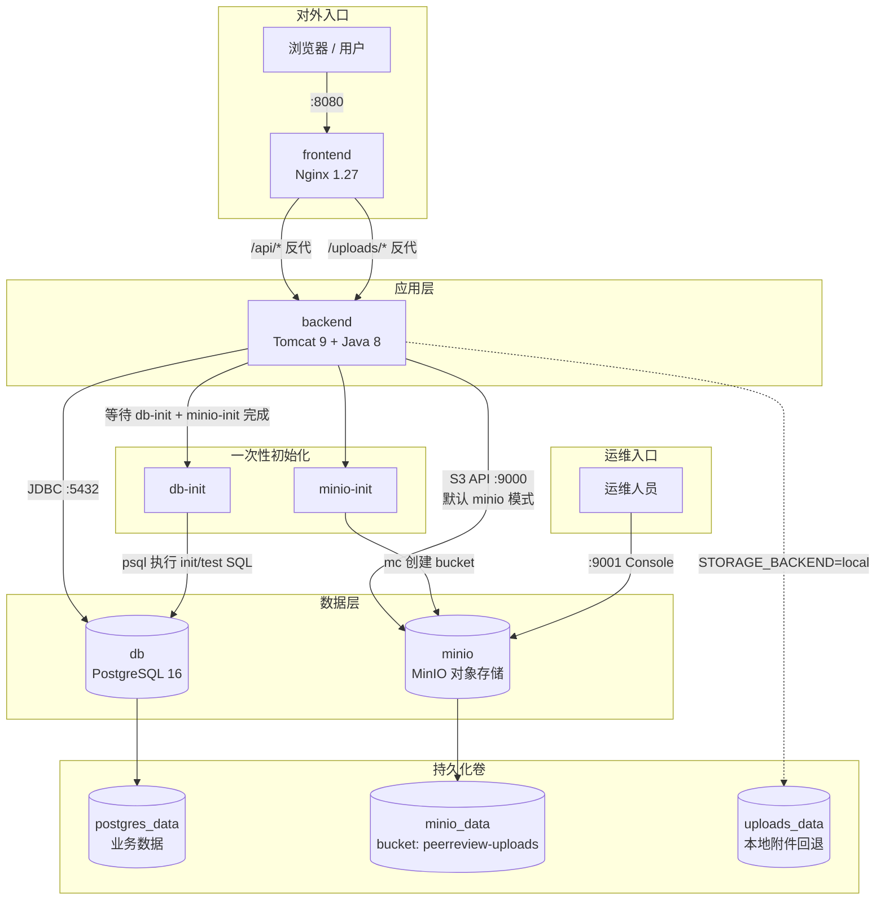

# PeerReview 课程作业互评平台 · 部署与运维手册

| 项目 | 说明 |
|------|------|
| 系统名称 | PeerReview（T-04 课程作业互评平台） |
| 部署方式 | Docker Compose 单机栈 |
| 数据库 | PostgreSQL 16（库名 `peerreview`） |
| 对象存储 | MinIO（默认，`peerreview-uploads` bucket；可回退 `local` 卷） |
| 文档版本 | v1.1 |
| 适用读者 | 接手运维的另一名工程师 |
| 目标 | 按本文档逐步操作，**1 小时内**可独立完成首次部署 |

---

## 1  架构概览

### 1.1  部署拓扑



**附件数据流（默认 MinIO 模式）：**

1. 学生上传 → `POST /api/submissions` → backend 写入 MinIO（object key：`uploads/{uuid}.ext`）→ PostgreSQL 记录 `file_path`。
2. 下载/预览 → `GET /api/submissions/download?submissionId=` → backend 从 MinIO 流式读出（前端不直连 MinIO）。
3. 设置 `STORAGE_BACKEND=local` 时，附件改存 `uploads_data` 卷，拓扑中 MinIO 连线可忽略。

### 1.2  组件职责（一句话）

| 组件 | 职责 |
|------|------|
| **frontend** | 托管 Vue 3 静态资源；将 `/api/`、`/uploads/` 反向代理至 backend |
| **backend** | Java Servlet + MyBatis 业务 API；JWT 鉴权；通过 `ObjectStorageService` 读写附件（MinIO / 本地卷） |
| **db** | PostgreSQL 持久化存储（用户、课程、作业、互评、申诉等 14 张表） |
| **db-init** | 容器启动后**仅执行一次**：运行 `sql/init.sql` + `sql/test_data.sql` 初始化库 |
| **minio** | S3 兼容对象存储，默认 bucket `peerreview-uploads`；Console 端口 9001 |
| **minio-init** | 容器启动后**仅执行一次**：`mc` 等待 MinIO 就绪并创建 bucket |
| **postgres_data** | 数据库数据卷，删卷即清空全部业务数据 |
| **minio_data** | MinIO 对象数据卷（默认附件存储），删卷即清空全部上传文件 |
| **uploads_data** | 本地附件卷（`STORAGE_BACKEND=local` 时使用），与 backend 内 `/data/uploads` 挂载 |

### 1.3  请求路径说明

- 用户仅访问 **frontend 暴露端口**（默认 `8080`）。
- backend **不对外映射端口**，仅 Docker 内网 `backend:8080` 可达。
- **MinIO API**（9000）与 **Console**（9001）默认映射宿主机，供运维管理；生产环境建议 9000 仅内网、9001 不对公网。
- 学生作业附件**不经浏览器直连 MinIO**，统一走 backend 下载 API。
- 数据库默认映射 `5432` 至宿主机，便于运维排查；生产环境建议关闭对外映射（见 2.3）。

---

## 2  环境与依赖

### 2.1  服务器规格

| 场景 | CPU | 内存 | 磁盘 | 带宽 | 数量 |
|------|-----|------|------|------|------|
| **开发 / 演示（最低）** | 2 核 | 4 GB | 20 GB 可用 | 不限 | 1 台 |
| **推荐（首次构建含 Maven/npm）** | 4 核 | 8 GB | 40 GB 可用 | ≥10 Mbps | 1 台 |
| **小型生产（≤200 并发用户）** | 4 核 | 8 GB | 100 GB SSD | 按业务 | 1 台 |

> 首次 `docker compose up --build` 需下载基础镜像并编译 WAR/前端，磁盘峰值约 5–8 GB（含 Docker 层缓存）。

### 2.2  软件依赖

| 软件 | 版本要求 | 用途 |
|------|----------|------|
| **Docker Engine** | ≥ 24.0 | 容器运行时 |
| **Docker Compose** | v2（`docker compose` 子命令） | 编排 |
| **操作系统** | Windows 10/11、Linux、macOS 均可 | 宿主机 |
| **PostgreSQL（容器内）** | 16-alpine | 由 compose 拉取，无需宿主机安装 |
| **Java / Maven / Node** | 无需宿主机安装 | 均在 Docker 多阶段构建内完成 |

**镜像源说明（重要）：**

- 默认 PostgreSQL 镜像：`public.ecr.aws/docker/library/postgres:16-alpine`（规避 Docker Hub TLS 证书问题）。
- 默认 MinIO 镜像：`m.daocloud.io/docker.io/minio/minio:latest`（及配套 `minio/mc`）。
- Backend 构建基础镜像：AWS ECR Public（Maven 3.9 + Temurin 8、Tomcat 9）。
- Frontend 构建基础镜像：AWS ECR Public（Node 20、Nginx 1.27）。
- 若 ECR / DaoCloud 不可达，在 `.env` 中覆盖 `POSTGRES_IMAGE`、`MINIO_IMAGE`、`MINIO_MC_IMAGE`。

**Windows 中文路径注意：** 若项目路径含中文导致 Docker 挂载异常，使用 `docker/docker-up.ps1` 同步至 `C:\peerreview-docker` 后再部署。

### 2.3  网络与端口

| 端口 | 协议 | 服务 | 建议 |
|------|------|------|------|
| **8080** | TCP | frontend（对外 Web 入口） | **开放**（或通过 Nginx/负载均衡转发） |
| **9000** | TCP | MinIO S3 API | 开发可开放；**生产建议仅 Docker 内网** |
| **9001** | TCP | MinIO Console（运维） | 开发可开放；**生产限制内网/VPN** |
| **5432** | TCP | PostgreSQL | 开发环境可开放；**生产建议仅内网或关闭宿主机映射** |
| 8080（容器内） | TCP | backend | **不映射宿主机**，仅 Docker 网络内访问 |

关闭 DB 对外端口的改法（`docker-compose.yml`）：

```yaml
# db 服务下删除或注释：
# ports:
#   - "5432:5432"
```

需开放的出站访问（拉镜像 / 构建）：

- `public.ecr.aws`（镜像）
- `repo.maven.apache.org`（backend 首次构建）
- `registry.npmjs.org`（frontend 首次构建）

### 2.4  外部服务清单

| 外部服务 | 本系统是否使用 | 凭证管理 |
|----------|----------------|----------|
| 短信 | **N/A** | 无 |
| 支付 | **N/A** | 无 |
| 地图 / 第三方 OAuth | **N/A** | 无 |

**本系统敏感配置（须通过环境变量 / `.env` 管理，禁止提交 Git）：**

| 变量 | 说明 | 默认值（仅演示） |
|------|------|------------------|
| `POSTGRES_PASSWORD` | PostgreSQL 密码 | `PeerReview@2026` |
| `JWT_SECRET` | JWT HS256 密钥（≥32 字符） | `PeerReview-JWT-Secret-32Bytes!!` |
| `APP_PORT` | 对外 Web 端口 | `8080` |
| `STORAGE_BACKEND` | 附件存储后端 | `minio`（可选 `local`） |
| `MINIO_ROOT_USER` / `MINIO_ROOT_PASSWORD` | MinIO 管理员凭证 | `minioadmin` / `minioadmin123` |
| `MINIO_BUCKET` | 对象存储桶名 | `peerreview-uploads` |
| `POSTGRES_IMAGE` | 可选，PostgreSQL 镜像地址 | ECR 公共库 |
| `MINIO_IMAGE` / `MINIO_MC_IMAGE` | 可选，MinIO 服务 / mc 客户端镜像 | DaoCloud 镜像 |

凭证管理建议：

1. 复制 `.env.example` 为 `.env`，修改密码与 JWT 密钥。
2. 将 `.env` 加入 `.gitignore`（若未加入请补充）。
3. 生产环境使用密钥管理工具（如 Vault、云厂商 KMS）注入环境变量，不落盘明文。

---

## 3  从零部署（Step-by-Step）

> **预计耗时：** 准备 10 min + 构建 15–40 min + 验证 10 min ≈ **35–60 min**（视网络与机器性能）。

### 3.1  准备阶段

#### 步骤 1：确认 Docker 可用

```powershell
docker version
docker compose version
```

**预期输出：** 分别显示 Client/Server 版本，Compose 版本 ≥ 2.x，无 `Cannot connect to the Docker daemon` 错误。

若报错 `dockerDesktopLinuxEngine ... file specified` → 启动 **Docker Desktop** 后重试。

#### 步骤 2：获取代码

将项目目录置于本地，例如：

```
课设代码/          ← 含 docker-compose.yml、sql/、src/、frontend/
```

#### 步骤 3：配置环境变量

```powershell
cd 课设代码
copy .env.example .env
# 编辑 .env，至少修改 POSTGRES_PASSWORD 与 JWT_SECRET
```

#### 步骤 4（Windows 可选）：同步至 ASCII 路径

路径含中文时执行：

```powershell
.\docker\docker-up.ps1
```

脚本会将代码镜像同步到 `C:\peerreview-docker` 并在该目录执行 compose。

---

### 3.2  安装与配置

#### 步骤 5：首次启动（含构建）

**方式 A — 标准（Linux / macOS / 英文路径 Windows）：**

```powershell
cd 课设代码
docker compose down -v          # 首次可跳过；重建库时必须 -v
docker compose up -d --build
```

**方式 B — Windows 中文路径：**

```powershell
.\docker\docker-up.ps1
```

**预期输出（节选）：**

```
✔ peerreview-backend    Built
✔ peerreview-frontend   Built
Container peerreview-db-1         Started
Container peerreview-db-init-1    Exited (0)
Container peerreview-backend-1    Started
Container peerreview-frontend-1   Started
```

> `db-init` 状态为 **Exited (0)** 属正常（一次性任务已完成）。

**首次构建耗时参考：** backend Maven 约 3–6 min，frontend npm 约 2–5 min，镜像拉取视网络 5–20 min。

#### 步骤 6：确认容器状态

```powershell
docker compose ps -a
```

**预期：**

| NAME | STATUS |
|------|--------|
| peerreview-db-1 | Up (healthy) |
| peerreview-db-init-1 | Exited (0) |
| peerreview-backend-1 | Up |
| peerreview-frontend-1 | Up |

#### 步骤 7：检查数据库初始化日志

```powershell
docker compose logs db-init
```

**预期末尾：**

```
>> Running init.sql...
>> Running test_data.sql...
>> Database initialization complete
```

#### 步骤 8：检查 backend 启动

```powershell
docker compose logs backend --tail 30
```

**预期包含：**

```
>> JDBC configured for jdbc:postgresql://db:5432/peerreview
...
Server startup in [xxxx] milliseconds
```

---

### 3.3  验证清单

按顺序勾选，全部通过即部署成功。

| # | 验证项 | 命令 / 操作 | 预期结果 |
|---|--------|-------------|----------|
| 1 | 容器健康 | `docker compose ps -a` | db healthy，backend/frontend Up |
| 2 | DB 初始化 | `docker compose logs db-init` | `Database initialization complete` |
| 3 | Web 可访问 | 浏览器打开 `http://localhost:8080/login` | 出现登录页 |
| 4 | 登录 API | 使用 `teacher01` / `123456` 登录 | 进入教师 Dashboard |
| 5 | 数据库有数据 | 见下方 psql 命令 | users 表 ≥ 38 行 |
| 6 | API 鉴权 | 未登录访问 `/api/courses` | 401 或跳转登录 |

**数据库抽样（可选）：**

```powershell
docker compose exec db psql -U peerreview -d peerreview -c "SELECT COUNT(*) FROM users;"
```

**预期：** `count` ≈ 39（含测试用户与 locked_stu）。

**测试账号（密码均为 `123456`）：**

| 角色 | 用户名 |
|------|--------|
| 管理员 | `admin` |
| 教师 | `teacher01`、`teacher02` |
| 助教 | `ta01` |
| 学生 | `stu2026001` … `stu2026032` |

---

## 4  日常运维

### 4.1  日志查看

```powershell
# 全栈跟踪（Ctrl+C 退出）
docker compose logs -f

# 单服务
docker compose logs -f backend
docker compose logs -f frontend
docker compose logs -f db

# 最近 200 行
docker compose logs backend --tail 200
```

| 日志来源 | 典型内容 |
|----------|----------|
| backend | Tomcat 启动、MyBatis SQL（STDOUT_LOGGING）、Servlet 异常栈 |
| frontend | Nginx access/error |
| db | PostgreSQL 连接、慢查询（默认较少） |
| db-init | 仅首次部署时有输出 |

MyBatis SQL 日志在生产环境可通过修改 `mybatis-config.xml` 关闭 `logImpl` 后重建 backend。

### 4.2  常见告警与处置

| 现象 | 可能原因 | 处置 |
|------|----------|------|
| `db-init Exited (1)` | SQL 脚本错误或 DB 未就绪 | `docker compose logs db-init` 查具体 SQL 行号；修复后 `docker compose down -v && up -d --build` |
| backend 反复 Restarting | JDBC 连不上 / 密码不一致 | 核对 `.env` 与 compose 中 `POSTGRES_PASSWORD`；`docker compose logs backend` |
| 登录后接口 401 | JWT 过期或未带 Token | 重新登录；确认 `JWT_SECRET` 未在运行中被修改 |
| 上传失败 413 | 文件过大 | Nginx `client_max_body_size 50m`；作业 `max_file_size_mb` 限制 |
| 附件 404 | uploads 卷空或路径错误 | 检查 `uploads_data` 卷；`docker compose exec backend ls /data/uploads` |
| 端口 8080 被占用 | 宿主机冲突 | `.env` 改 `APP_PORT=8081` 后 `docker compose up -d` |

### 4.3  数据备份与恢复

#### 4.3.1  PostgreSQL 逻辑备份

```powershell
# 备份（生成 peerreview_YYYYMMDD.sql）
docker compose exec db pg_dump -U peerreview -d peerreview -F p > backup_peerreview_%date:~0,4%%date:~5,2%%date:~8,2%.sql

# Linux / macOS
docker compose exec db pg_dump -U peerreview -d peerreview -F p > backup_peerreview_$(date +%Y%m%d).sql
```

#### 4.3.2  附件备份

```powershell
docker run --rm -v peerreview_uploads_data:/data -v ${PWD}:/backup alpine tar czf /backup/uploads_backup.tar.gz -C /data .
```

#### 4.3.3  恢复数据库

```powershell
# 停止 backend 避免写入冲突
docker compose stop backend frontend

# 恢复（示例）
docker compose exec -T db psql -U peerreview -d peerreview < backup_peerreview_20260603.sql

docker compose start backend frontend
```

#### 4.3.4  完全重置（清空所有数据）

```powershell
docker compose down -v
docker compose up -d --build
```

> **警告：** `-v` 会删除 `postgres_data` 与 `uploads_data`，不可恢复。

### 4.4  性能巡检

| 巡检项 | 命令 | 关注阈值 |
|--------|------|----------|
| 容器资源 | `docker stats` | backend CPU 持续 >80%、内存接近 limit |
| 磁盘 | `docker system df` | 镜像/卷占用 >80% 磁盘需清理 |
| DB 连接 | `docker compose exec db psql -U peerreview -d peerreview -c "SELECT count(*) FROM pg_stat_activity;"` | 异常堆积 |
| 响应时间 | 浏览器 F12 → Network，抽查 `/api/courses` | >3s 需排查 DB/慢 SQL |

**建议巡检频率：** 演示环境每周；生产环境每日自动化 + 每周人工复核。

---

## 5  版本升级与回滚

> 本系统为 **Docker Compose 单机部署**，无 K8s 灰度能力；以下以「重建镜像 + 滚动重启」代替灰度。

### 5.1  灰度发布步骤

**N/A — 理由：** 当前架构为单节点 Compose，未接入多副本负载均衡。替代方案：

1. 在**备用目录/备用机器**部署新版本完整栈（不同 `APP_PORT`）。
2. 人工验证通过后，切换 DNS/反向代理至新端口。
3. 旧栈保留 24h 便于回滚。

### 5.2  回滚步骤

#### 应用回滚（代码版本）

```powershell
git checkout <上一个稳定 tag 或 commit>
docker compose build backend frontend
docker compose up -d
```

若无 Git，从备份目录恢复代码后再 `docker compose up -d --build`。

#### 镜像回滚（若已 tag 旧镜像）

```powershell
docker tag peerreview-backend:backup peerreview-backend:latest
docker compose up -d --no-build backend
```

#### 数据库回滚

使用 4.3 节 pg_dump 备份文件按时间点恢复；**无法**仅通过重启容器回滚 schema。

### 5.3  数据库变更（含迁移脚本）

| 场景 | 操作 |
|------|------|
| **改表结构** | 编辑 `sql/init.sql`，编写增量脚本 `sql/migrations/Vxxx_description.sql` |
| **仅改测试数据** | 编辑 `sql/test_data.sql` |
| **应用到已有库** | `docker compose exec -T db psql -U peerreview -d peerreview -f /sql/migrations/Vxxx.sql`（需将脚本挂载进容器） |
| **开发环境一键重建** | `docker compose down -v && docker compose up -d --build` |

**SQL Server 历史脚本：** 已归档于 `sql/legacy-sqlserver/`，**勿**在生产 PG 环境执行。

**变更检查清单：**

1. 在测试环境 `down -v` 全量初始化验证。
2. 生产环境先 `pg_dump` 备份。
3. 执行迁移脚本并验证关键 API（登录、提交、互评、申诉）。
4. 更新本文档版本号与变更记录。

---

## 6  故障应急 Runbook（≥ 5 类）

### 6.1  Docker 无法拉取镜像（TLS / 证书错误）

| 项 | 内容 |
|----|------|
| **现象** | `x509: certificate signed by unknown authority`；`failed to resolve reference docker.io/...` |
| **排查** | 确认是否访问 Docker Hub；检查校园网/公司代理；试 `docker pull public.ecr.aws/docker/library/postgres:16-alpine` |
| **处置** | ① compose 已默认 ECR 镜像，确保 `.env` 未改回 `postgres:16-alpine`；② 设置 `POSTGRES_IMAGE=docker.m.daocloud.io/library/postgres:16-alpine`；③ Docker Desktop 配置 registry mirrors |
| **预防** | 文档化镜像源；CI 预拉镜像至私有 Registry |

### 6.2  容器名称冲突

| 项 | 内容 |
|----|------|
| **现象** | `The container name "/peerreview-db-1" is already in use` |
| **排查** | `docker ps -a --filter name=peerreview` |
| **处置** | 若旧栈仍在运行且正常 → **无需重复 up**，直接访问 8080；若需重建 → 在原目录 `docker compose down` 后再 up；禁止同时在两个目录各起一套 compose |
| **预防** | 统一部署目录（如仅 `C:\peerreview-docker` 或仅 `PeerReview`） |

### 6.3  数据库初始化失败（db-init exit 1）

| 项 | 内容 |
|----|------|
| **现象** | `db-init` Exited (1)；backend 无法启动 |
| **排查** | `docker compose logs db-init` 查看 psql 报错行 |
| **处置** | 修复 `sql/init.sql` 或 `test_data.sql` → `docker compose down -v` → `docker compose up -d --build` |
| **预防** | SQL 变更在本地用 `psql` 或临时容器预演；`ON_ERROR_STOP=1` 保证失败即停 |

### 6.4  登录成功但业务 API 全部 401

| 项 | 内容 |
|----|------|
| **现象** | 登录后 Dashboard 空白；Network 中 API 返回 401 |
| **排查** | 是否修改过 `JWT_SECRET` 未重启 backend；浏览器 LocalStorage 是否残留旧 token |
| **处置** | 清除站点 LocalStorage → 重新登录；`docker compose restart backend`；确认 compose 与 `.env` 中 JWT 一致 |
| **预防** | 密钥变更走维护窗口并通知用户重新登录 |

### 6.5  附件无法预览 / 下载 404

| 项 | 内容 |
|----|------|
| **现象** | 提交列表有记录，点击附件 404；或 Tomcat 静态路径失效 |
| **排查** | `docker compose exec backend ls -la /data/uploads`；API `GET /api/submissions/download?submissionId=` 是否正常 |
| **处置** | 确认 `uploads_data` 卷已挂载；检查 `UploadPathUtil` 与 DB 中 `file_path`；勿删除 backend 内 uploads 符号链接逻辑 |
| **预防** | 定期备份 uploads 卷；升级前验证下载 API |

### 6.6  磁盘占满导致构建失败

| 项 | 内容 |
|----|------|
| **现象** | `no space left on device`；Maven/npm 构建中断 |
| **排查** | `docker system df` |
| **处置** | `docker system prune -a`（谨慎，会删未使用镜像）；扩大磁盘；迁移 Docker 数据目录 |
| **预防** | 设置磁盘告警；定期 prune 构建缓存 |

---

## 7  容量与扩展

### 7.1  瓶颈点

| 瓶颈 | 说明 | 典型症状 |
|------|------|----------|
| **backend 单实例** | Tomcat 单进程，CPU 密集在 PDF 查重、Excel 导出 | 互评高峰响应变慢 |
| **PostgreSQL 单节点** | 无读写分离 | 统计报表、分页列表延迟升高 |
| **uploads 卷 I/O** | 大文件上传与磁盘带宽 | 并发上传超时 |
| **单机 Compose** | 无水平扩展 | 单点故障 |

### 7.2  扩展方案

| 阶段 | 方案 |
|------|------|
| **短期（演示 / 课设）** | 垂直扩容：4 核 8G → 8 核 16G；关闭 MyBatis SQL 日志 |
| **中期（200+ 用户）** | PostgreSQL 连接池调优；Nginx 前置 + 多 backend 副本（需改 compose 为 `deploy.replicas` 或 Swarm）；附件迁对象存储（OSS/S3） |
| **长期（生产）** | K8s 部署；RDS/云 PG；Redis 会话；CDN 静态资源；独立文件服务 |

### 7.3  Compose 水平扩展示例（进阶）

```yaml
# 需配合外部负载均衡，超出课设默认范围
backend:
  deploy:
    replicas: 2
```

frontend `nginx.conf` 中 `proxy_pass http://backend:8080` 在 replicas>1 时需改为 upstream 或服务名负载（Docker Compose 内置 DNS 轮询）。

---

## 附录 A  常用命令速查

```powershell
docker compose up -d --build      # 构建并启动
docker compose down               # 停止并删除容器（保留卷）
docker compose down -v            # 停止并删除容器+卷
docker compose restart backend    # 重启后端
docker compose ps -a              # 状态
docker compose logs -f backend    # 日志
docker compose exec db psql -U peerreview -d peerreview  # 进库
```

## 附录 B  目录与文件索引

| 路径 | 说明 |
|------|------|
| `docker-compose.yml` | 服务编排主文件 |
| `.env` / `.env.example` | 环境变量 |
| `docker/init-db.sh` | DB 初始化入口 |
| `docker/init-minio.sh` | MinIO bucket 初始化入口 |
| `docker/entrypoint-backend.sh` | 注入 JDBC、解压 WAR |
| `docker/nginx.conf` | 前端反代规则 |
| `docker/docker-up.ps1` | Windows 中文路径部署脚本 |
| `sql/init.sql` | 建表（PostgreSQL） |
| `sql/test_data.sql` | 测试数据 |
| `sql/legacy-sqlserver/` | 旧 SQL Server 脚本归档 |

## 附录 C  文档变更记录

| 版本 | 日期 | 变更说明 | 作者 |
|------|------|----------|------|
| v1.1 | 2026-06 | 更新部署拓扑：MinIO 对象存储、minio-init、local 回退模式 | — |
| v1.0 | 2026-06 | 首版：PostgreSQL + Docker Compose 部署 | — |

---

*文档结束*
